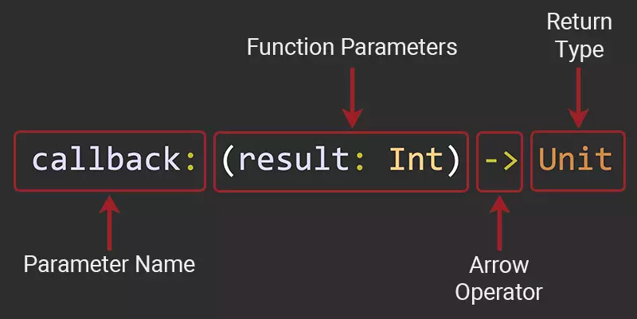
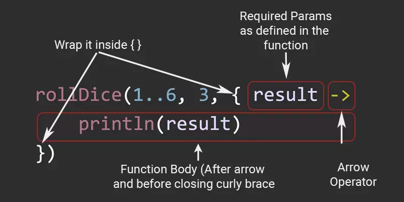

## [Higher Order Function:]()

Định nghĩa: (functions) có thể được truyền vào như một biến của hàm khác, và cũng có thể được trả về từ một hàm nào đó. Đấy chính là Higher Order Function.


```kotlin
//A simple Higher Order Function in Kotlin
//This function accepts three parameters 
//And the last parameter is a function
fun rollDice(range: IntRange, 
             time: Int, 
             callback: (result: Int) -> Unit
) {
    for (i in 0 until time) {
        val result = range.random()
        //As the last parameter is a function 
        //we can call it as a function
        callback(result)
    }
}
```

Trong 3 tham số truyền vào của hàm rollDice, thì tham số thứ ba chính là một function



`Giải thích:`
Trong đó, callback chính là tên của functions, đồng thời là tên của tham số truyền vào. (result: Int) lại chính là tham số của callback. Còn Unit chính là kiểu trả về của function.


`Gọi Higher Order Function:`
```kotlin
fun main() {
    rollDice(1..6, 3, { result ->
        println(result)
    })
}
```



`Giải thích:`
Ở đây, result chính là tham số của hàm callback. Lệnh println chính là công việc thực hiện tương ứng với hàm callback ở trên.


## [Phần 2 - Lambda?]()

- Biểu thức của lambda luôn được bao bởi {}
- Nếu lambda function có bất kì param nào nó phải ở trước toán tử -> (kiểu dữ liệu của param có thể được bỏ qua)
- Body của lambda function phải ở sau toán tử ->

```kotlin
//1
doSomethingWithNumber(1000, { result ->
    // do something with result
})

//2
doSomethingWithNumber(1000, { result : String? ->
    // do something with result
})

//3
doSomethingWithNumber(1000) { result ->
    // do something with result
}
```

### 3 cách sử dụng trên là như nhau và như các cách function reference và function anonymous.

- it: implicit name of a single parameter
```kotlin
doSomethingWithNumber(1000) {
    println("The result is $it")
    // do something with result
} 
```

- Destructuring trong Lambdas
```kotlin
map.mapValues { entry -> "${entry.value}!" }
map.mapValues { (key, value) -> "$value!" }
```

- Lambda return:
```kotlin
//The first way
ints.filter {
    val shouldFilter = it > 0
    shouldFilter
}

//The second way
ints.filter {
    val shouldFilter = it > 0
    return@filter shouldFilter
}
```

## Function Literals:
- A function literal is just an expression that defines an unnamed function.: Hàm chữ chỉ là một biểu thức xác định một hàm không tên.

```kotlin
val m = { (x : String) -> println("$x") }
val n : (String) -> Unit = { x -> println("$x") }
val o : (String) -> Unit = { (x : String) -> println("$x") }

fun main(args : Array<String>) {
 m("good morning")
 n("good morning")
 o("good morning")
}
```


