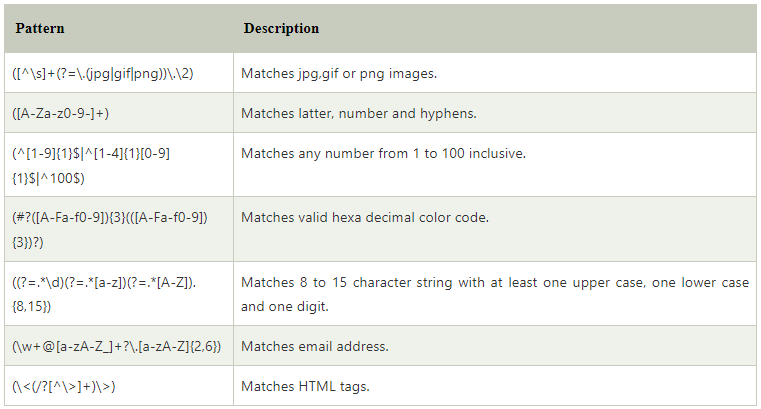

## Kotlin Regex Pattern

| Symbol  | Description                                                                              |
|---------|------------------------------------------------------------------------------------------|
| x/y     | 	Matches either x or y                                                                   |
| xy	     | Matches x followed by y                                                                  |
| [xyz]	  | Matches either x,y,z                                                                     |
| [x-z]	  | Matches any character from x to z                                                        |
| [^x-z]	 | '^' as first character negates the pattern. This matches anything outside the range x-z  |
| ^xyz	   | Matches expression xyz at beginning of line                                              |
| xyz$	   | Matches expression xyz at end of line                                                    |
| .	      | Matches any single character                                                             |

## Regex Meta Symbols

| Symbol  | Description                                      |
|---------|--------------------------------------------------|
| \d	     | Matches digits ([0-9])                           |
| \D	     | Matches non-digits                               |
| \w	     | Matches word characters                          |
| \W	     | Matches non-word characters                      |
| \s	     | Matches whitespaces [\t\r\f\n]                   |
| \S	     | Matches non-whitespaces                          |
| \b	     | Matches word boundary when outside of a bracket. |
| \B	     | Matches non-word boundary                        |
| \A	     | Matches beginning of string                      |
| \Z	     | Matches end of String                            |

## Regex Quantifiers Patterns

| Symbol     | Description                                      |
|------------|--------------------------------------------------|
| abcd?	     | Matches 0 or 1 occurrence of expression abcd     |
| abcd*	     | Matches 0 or more occurrences of expression abcd |
| abcd+	     | Matches 1 or more occurrences of expression abcd |
| abcd{x}	   | Matches exact x occurrences of expression abcd   |
| abcd{x,}	  | Matches x or more occurrences of expression abcd |
| abcd{x,y}	 | Matches x to y occurrences of expression abcd    |

## Regex Sample Patterns

